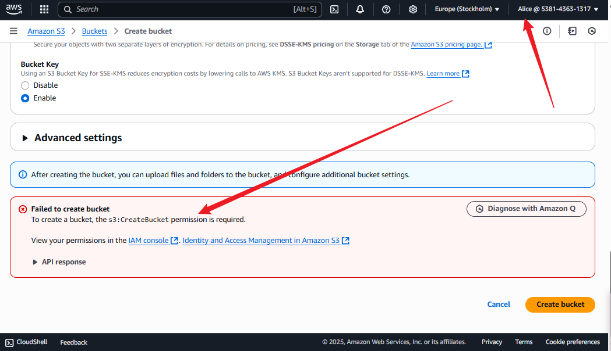

# 🔐 AWS IAM Management Automation Project

## 📌 Project Overview

This project automates the provisioning of AWS IAM users, groups, custom policies, and login profiles for a fictional fintech company, *Zappy e-Bank*. The objective is to implement access control based on roles (Dev, Ops, Audit) while enforcing security best practices like strong password policies and the principle of least privilege.

## 🛠 Technologies Used

- *AWS CLI* (v2)
- *Bash Scripting*
- *IAM Policies (Managed & Custom)*
- *Linux Terminal (Ubuntu)*
- *AWS Console for Testing*

## 👤 Author

*Name:* Omoghene Erubami  
*Date:* 31 July – 1 August, 2025  
*Role:* DevOps Engineer  


## 🧾 Project Files

| Filename                    | Purpose                                                         |
|----------------------------|-----------------------------------------------------------------|
| iam-setup.sh             | Automates creation of users, groups, and custom IAM policies    |
| assign-login-profiles.sh | Assigns passwords, login access, and permissions to IAM users   |
| developer-ec2-policy.json| Defines EC2 access policy for developers                        |
| audit-s3-policy.json     | Defines S3 access policy for auditors                          |
| README.md                | Project documentation with testing results                      |

---

## 🧪 Functional Breakdown

### 🧱 1. IAM Setup Script (iam-setup.sh)

This script does the following:

- Creates three IAM groups: developers, operations, auditors
- Adds users to each group:
  - Developers: *John, **Alice*
  - Operations: *Mark, **Emma*
  - Auditors: *Susan*
- Creates custom IAM policies:
  - DeveloperEC2FullAccess (EC2 full access for developers)
  - AnalystS3FullAccess (S3 full access for auditors)
- Attaches the following policies:
  - Developers → EC2 custom policy
  - Auditors → S3 custom policy
  - Operations → AWS Managed ReadOnlyAccess policy


### 🔐 2. Assign Login Profiles (assign-login-profiles.sh)

This script assigns passwords and login permissions:

- Creates login profiles for each user with the default password: ZappySecure@2025
- Enforces password reset on first login
- Attaches AWS managed policy: IAMUserChangePassword
- Configures account-level password policy (symbols, upper/lowercase, numbers)


## 🔍 Testing & Verification

### ✅ User Login Test

- Attempted to log in with  *Alice, **Emma, **Susan
- Verified that:
  - Password reset was required on first login
  - Login success/failure was logged


### 🚫 Permissions Validation

Performed permission tests for various users:

| User   | Group      | Action Attempted  | Result                      | Screenshot? |
|--------|------------|-------------------|-----------------------------|-------------|
| Emma   | Operations | Create S3 bucket  | ❌ Access Denied (as expected) | ✅ Yes       |
| Susan  | Auditors   | Launch EC2 instance | ❌ Access Denied (as expected) | ✅ Yes       |
| John   | Developers | Launch EC2 instance | ✅ Allowed                    | ✅ Yes       |
| Susan  | Auditors   | Access S3 bucket  | ✅ Allowed                    | ✅ Yes       |

These tests confirmed that:
- IAM policies were correctly attached
- Users could only access resources permitted by their group's policy


## 📦 How to Run

1. *Prerequisites*:
   - AWS CLI configured (aws configure)
   - IAM admin permissions

2. *Execution*:
   ```bash
   chmod +x iam-setup.sh assign-login-profiles.sh
   ./iam-setup.sh
   ./assign-login-profiles.sh
   ```

   ## Below are screenshots of workflow:

   
   
   
   
   
   
   
   
   
   
   
   
   
   
   
   
   
   
   
   
   
   
   
   
   
   